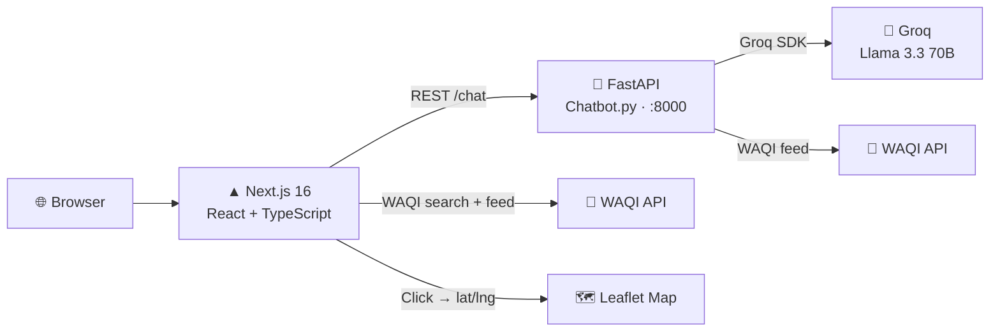

<p align="center">
  
</p>

<p align="center">
  
</p>

<p align="center">
  
  
  
  
  
  
  
</p>

---

## What is Kripa?

**Kripa** is a neon-styled, real-time air quality monitoring dashboard. It pulls live sensor data from the [World Air Quality Index (WAQI)](https://waqi.info/) network, plots it on an interactive Leaflet map, and surfaces it through a glassmorphism UI — all accompanied by **AeroGuard AI**, a clinical chatbot powered by Groq's Llama 3.3 70B model with tool-calling.

Built specifically for health-sensitive users (asthma, COPD, chronic bronchitis), it doesn't just show you a number — it tells you exactly what that number means for *your* body and what to do about it.

---

## ✨ Features

| Feature | Details |
|---|---|
| 🗺 **Interactive Live Map** | Click anywhere on the Leaflet map → instant real AQI from the nearest sensor |
| 📊 **Animated AQI Gauge** | SVG ring gauge, 24 h avg / peak / low stats, auto-refreshes every 60 s |
| 🤖 **AeroGuard AI Chatbot** | Groq Llama 3.3 70B with function-calling: fetches current & predicted AQI, gives clinical assessments |
| 🏙 **Global City Search** | Resolves city names → WAQI station UIDs via the search endpoint (no "Unknown Station" errors) |
| 🧬 **Health Bio-Data Panel** | Upload your medical records (PDF/DOCX) — AI overrides default severity protocols to match your conditions |
| 📷 **Camera / Image Mode** | Live webcam capture or image upload; CNN-scan animation + air quality context analysis |
| ⚠️ **Smart Alert Banners** | Auto-triggered warnings at AQI > 150; bell icon pulses red |
| 📈 **Trend Chart + Forecast** | Recharts 24 h area chart + prediction card for tomorrow's AQI |
| 🌑 **Dark / Neon Theme** | Glassmorphism cards with per-pollutant glow colours, animated background |

---

## 🎨 AQI Scale

```
  0 ─────  50   🟢  Good               Safe for everyone
 51 ───── 100   🟡  Moderate           Acceptable; some pollutants may affect sensitive individuals
101 ───── 150   🟠  Unhealthy*         Sensitive groups should limit outdoor exertion
151 ───── 200   🔴  Unhealthy          Everyone may experience health effects
201 ───── 300   🟣  Very Unhealthy     Health alert — serious effects for everyone
301+             🟤  Hazardous          Emergency conditions
                                        (* Sensitive Groups)
```

---

## 🏗 Architecture



---

## ⚡ Quick Start

### Prerequisites
- **Node.js** ≥ 20
- **Python** ≥ 3.11
- **npm** or **pnpm**
- API keys (see [Environment Variables](#-environment-variables))

### 1 — Clone
```bash
git clone https://github.com/RudeHats/kripa.git
cd kripa
```

### 2 — Set up environment variables
```bash
# Copy the safe template; never commit your real keys
cp .env.example .env.local    # Next.js reads this automatically
cp .env.example .env          # Python backend reads this
```
Then open `.env.local` (and `.env`) and fill in your keys:

```env
NEXT_PUBLIC_WAQI_TOKEN=your_waqi_token     # https://aqicn.org/api/
GROQ_API_KEY=your_groq_api_key             # https://console.groq.com/
WAQI_API_TOKEN=your_waqi_token             # same token, Python side
HF_TOKEN=your_huggingface_token            # optional — AQI LSTM prediction
```

### 3 — Install and run the Next.js frontend
```bash
npm install
npm run dev
# → http://localhost:3000
```

### 4 — Install and run the Python AI backend
```bash
pip install fastapi uvicorn groq requests python-dotenv
python Chatbot.py
# → http://localhost:8000
```

Both services need to run simultaneously. The chatbot UI is hidden until port 8000 responds.

---

## 🐳 Docker (Recommended)

Run the full stack with a single command:

```bash
cp .env.example .env          # fill in your keys inside .env
docker compose up --build
```

| Service | URL |
|---|---|
| Next.js Dashboard | http://localhost:3000 |
| FastAPI Chatbot | http://localhost:8000 |

To stop:
```bash
docker compose down
```

> **Note:** The Python backend reads secrets from the `.env` file mounted at runtime.  
> The Next.js image bakes `NEXT_PUBLIC_WAQI_TOKEN` in at build time — set it before `docker compose up`.

---

## 📁 Directory Structure

```
kripa/
├── app/
│   ├── layout.tsx           ← root layout, metadata, Google Fonts
│   ├── page.tsx             ← entry point
│   └── globals.css          ← animation keyframes, glass/neon utilities
├── components/aqi/
│   ├── dashboard.tsx        ← main grid layout, data fetching, auto-refresh
│   ├── aqi-chatbot.tsx      ← floating chat UI, camera capture, image upload
│   ├── aqi-gauge.tsx        ← animated SVG ring gauge
│   ├── map-selector.tsx     ← Leaflet map with click-to-fetch handler
│   ├── city-search.tsx      ← global city autocomplete (WAQI search API)
│   ├── settings-modal.tsx   ← bio-data upload + general settings panel
│   ├── trend-chart.tsx      ← 24 h Recharts area chart
│   ├── prediction-card.tsx  ← tomorrow's AQI forecast card
│   ├── pollutants-chart.tsx ← radial bar chart for PM2.5 / PM10 / NO₂ / O₃
│   ├── alert-banner.tsx     ← threshold-triggered dismissible warning
│   └── animated-*.tsx       ← reusable glass/glow base components
├── lib/
│   ├── waqi-api.ts          ← fetchWAQIData (geo) + fetchWAQIByCity (search)
│   └── aqi-data.ts          ← getAQIColor, getAQICategory, mock data shape
├── Chatbot.py               ← FastAPI + Groq AI backend (port 8000)
├── Dockerfile               ← Next.js production image
├── Dockerfile.backend       ← Python FastAPI image
├── compose.yml              ← orchestrates both services
└── .env.example             ← copy → .env.local + .env, then add your keys
```

---

## 🛠 Tech Stack

### Frontend
| | |
|---|---|
| Framework | Next.js 16 / React 19 / TypeScript 5.7 |
| Styling | Tailwind CSS v4, Radix UI primitives |
| Charts | Recharts 2.15 |
| Maps | Leaflet 1.9 / react-leaflet |
| Icons | Lucide React |
| Analytics | Vercel Analytics |

### AI Backend
| | |
|---|---|
| Runtime | Python 3.11+ / FastAPI / Uvicorn |
| LLM | Groq — Llama 3.3 70B Versatile |
| Tool calling | `get_current_aqi`, `get_predicted_aqi` functions |
| Optional | HuggingFace Inference API (LSTM AQI prediction) |

### External APIs
| | |
|---|---|
| Air quality data | [WAQI](https://waqi.info/) — global sensor network |
| City → station | WAQI `/search/` endpoint |
| AI inference | [Groq](https://groq.com/) (≤1 s response times) |

---

## 🌍 Environment Variables

| Variable | Required | Where | Description |
|---|---|---|---|
| `NEXT_PUBLIC_WAQI_TOKEN` | ✅ | `.env.local` | WAQI API token for the frontend |
| `GROQ_API_KEY` | ✅ | `.env` | Groq API key for the AI backend |
| `WAQI_API_TOKEN` | ✅ | `.env` | WAQI token for the Python backend |
| `HF_TOKEN` | ☑️ optional | `.env` | HuggingFace token for LSTM prediction |
| `HF_API_URL` | ☑️ optional | `.env` | Full HuggingFace model inference URL |

Get your free tokens:
- WAQI → [aqicn.org/api](https://aqicn.org/api/)
- Groq → [console.groq.com](https://console.groq.com/)
- HuggingFace → [huggingface.co/settings/tokens](https://huggingface.co/settings/tokens)

---

## 🤝 Contributing

Pull requests are welcome. For significant changes, please open an issue first.

1. Fork the repo
2. Create a feature branch (`git checkout -b feat/my-feature`)
3. Commit with clear messages (`git commit -m "feat: describe what changed and why"`)
4. Push and open a PR

---

## 📜 License

Distributed under the **MIT License** — see [`LICENSE`](LICENSE) for details.

---

<p align="center">
  
</p>

<p align="center">
  Built with ❤️ by <a href="https://github.com/RudeHats">RudeHats</a> · Powered by WAQI · Groq · Next.js · FastAPI
</p>
